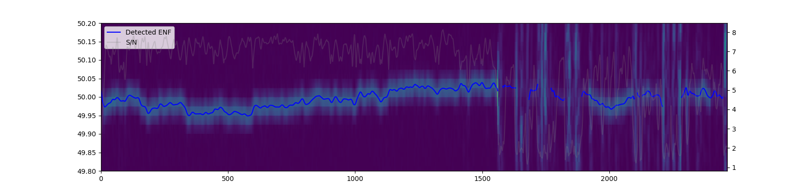

# Libhum



Libhum is a Python library and set of utilities to extract and compare
[electricity frequency signals](https://en.wikipedia.org/wiki/Electrical_network_frequency_analysis)
(ENF).

The library uses GPU accelaration (CUDA or OpenCL) to accurately match ENF signals in seconds.

On an Apple Macbook Air M1, the library is able to match an 1 hour signal over a 10 years history in
about 20 seconds.

# Setup

```
pip install libhum
```

# Compute ENF

Use the `compute_enf` command to extract the main ENF from an audio or video file to an `.enf` file:

```
libhum compute_enf samples/target.ogg target.enf --plot
```

By default, the library is looking for an ENF signal in the 50 Hz band. Use the `-f/--frequency`
option to use a different frequency.

# Match ENFs


Use the `match_enf` command to find the best matches between two signals:

```
libhum match_enf samples/reference.enf samples/target.enf --plot
```

The default backend is using Numpy and is considerably slower than the OpenCL or CUDA backends which
rely on GPU accelaration. Append the `--backend=cuda` or `--backend=opencl` option to use a
GPU-accelerated backend.

# Special thanks

Some of the signal processing algorithms used by the library originate from Robert Heaton's
[ENF matching library](https://github.com/robert/enf-matching).

# License

See [LICENSE](LICENSE) file for details.

# BibTeX Citation

If you use Libhum in any scientific publication, please use the following BibTex citation:

```
@software{Javaux_Libhum,
    author = {Javaux, Raphael},
    license = {LGPL-3.0},
    title = {{Libhum}},
    url = {https://github.com/RaphaelJ/libhum},
    year={2024},
}
```